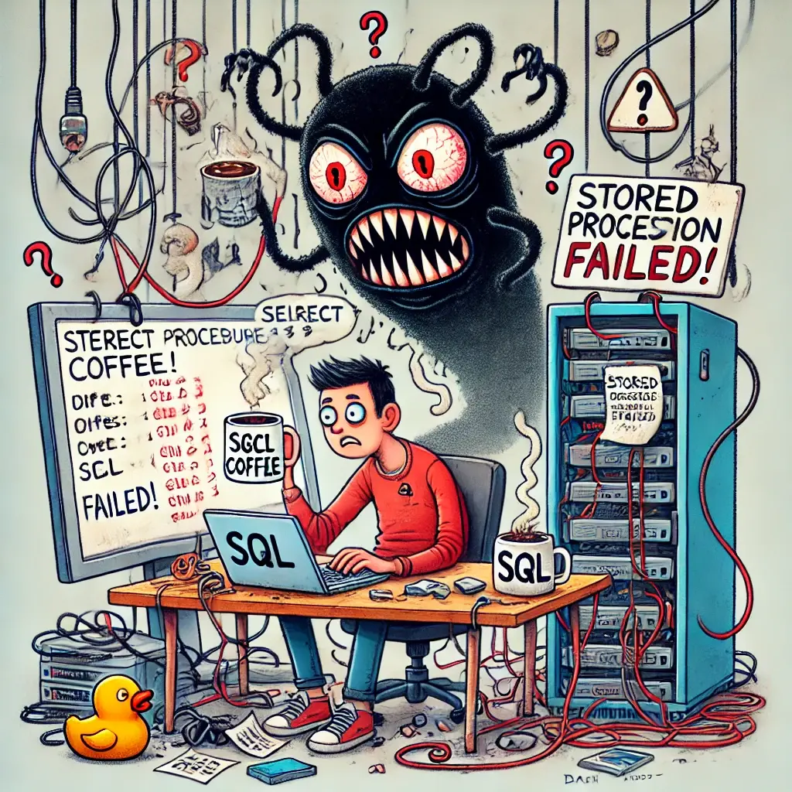

# Testing the untestable



## Introduction

Hello everyone, and thank you for joining me today.  
Today, we are going to talk about **how to test stored procedures in an MS SQL Server database** using **TestContainers** and **Respawn**.

By the end of this session, you'll be equipped to write **robust and isolated** database tests in C#.

## Why test stored procedures?

Stored procedures contain business logic that can be complex and mission-critical.  
Common challenges when testing them:

- **Database dependencies**: You need a database instance to test against.
- **Test data reset**: How do we ensure a clean state between tests?
- **Isolation**: We want tests that don’t interfere with each other.

This is where **TestContainers** and **Respawn** come into play.

## What are TestContainers and Respawn?

1. **TestContainers** ([URL](https://testcontainers.com/modules/mssql/?language=dotnet)):

   - A library for running docker containers in integration tests.
   - Provides **isolated, reproducible** test environments.
   - No need for manually setting up a database.

2. **Respawn** ([URL](https://github.com/jbogard/Respawn)):

   - A library by **Jimmy Bogard** that helps reset database state between tests.
   - Instead of rebuilding the database, it **efficiently truncates tables**.

## Setting Up the Project


We’ll now walk through an example of setting up a test for a **stored procedure** using these tools.

### Step 1: Install Project Dependencies

```sh
dotnet add code/Tests package TestContainers.MsSql
dotnet add code/Tests package Respawn
dotnet add code/Tests package Bogus
```

### Step 2: Creating a Stored Procedure

Let’s assume we have a stored procedure that retrieves active users. The stored procedure is created with a common Migration in Entity Framework.

```sql
CREATE PROCEDURE [dbo].[GetActiveUsers] AS
BEGIN
  SELECT Id, Name, Email
  FROM Users
  WHERE IsActive = 1;
END
```

The Stored procedure can be accessed via a wrapper Method on the database context:

```cs
public IReadOnlyCollection<ActiveUser> GetActiveUsers()
{
    return Database.SqlQuery<ActiveUser>($"EXEC GetActiveUsers").ToList().AsReadOnly();
}
```

We need to test:

- If the stored procedure correctly returns **active users**.
- If it **excludes inactive users**.

### Step 3: Bootstrapping the Tests


#### Create a shared ClassFixture

```cs
using Microsoft.EntityFrameworkCore;
using Testcontainers.MsSql;

namespace Tests;

public class DatabaseFixture : IAsyncLifetime
{
    public String ConnectionString { get; private set; }

    public MsSqlContainer DbContainer { get; }

    public AwesomeDatabase CreateContext() => new(ConnectionString);

    public DatabaseFixture()
    {
        DbContainer = new MsSqlBuilder()
            .WithImage("mcr.microsoft.com/mssql/server:2019-latest")
            .WithPassword("Dev0nly!")
            .Build();
    }

    public async Task InitializeAsync()
    {
        await DbContainer.StartAsync();
        ConnectionString = DbContainer.GetConnectionString();

        await using AwesomeDatabase context = new(ConnectionString);
        await context.Database.MigrateAsync();
    }

    public async Task DisposeAsync()
    {
        await DbContainer.DisposeAsync();
    }
}
```

This fixture will ensure, that at the beginning of a test run, the container with an empty database will be created and on the end of the run, the container will be cleaned up.

It also stores the connection string to the currently created database for use in the tests if needed

#### Create some Mock data

```cs
using Bogus;

namespace Tests;

public static class MockData
{
    private static readonly Faker Faker = new Faker();

    private static User CreateUser(bool isActive)
    {
        return new User
        {
            Name = Faker.Name.FullName(),
            Email = Faker.Internet.Email(),
            IsActive = isActive
        };
    }

    public static User CreateActiveUser() => CreateUser(true);
    public static User CreateInactiveUser() => CreateUser(false);
}
```

The Faker from the bogus package helps us to create useful random Values.

## Creating Tests


### Create a first test

```cs
using Respawn;
using static Tests.MockData;

namespace Tests;

public class StoredProcedureTests(DatabaseFixture fixture): IClassFixture<DatabaseFixture>
{
    [Fact]
    public void GetActiveUsers_returns_only_active_users()
    {
        using AwesomeDatabase context = _fixture.CreateContext();
        User activeUser = CreateActiveUser();
        User inactiveUser = CreateInactiveUser();

        context.Users.Add(activeUser);
        context.Users.Add(inactiveUser);

        context.SaveChanges();

        IReadOnlyCollection<ActiveUser> activeUsers = context.GetActiveUsers();

        ActiveUser user = Assert.Single(activeUsers);
        Assert.Equal(activeUser.Name, user.Name);
    }
}
```

#### Run the tests

Run the tests using:

```sh
dotnet test
```

Expected result: Ensures only active users are returned

### Adding a second Test

```cs
[Fact]
public void GetActiveUsers_returns_2_if_there_are_2_active_users()
{
    using AwesomeDatabase context = _fixture.CreateContext();
    context.Users.Add(CreateActiveUser());
    context.Users.Add(CreateInactiveUser());
    context.Users.Add(CreateActiveUser());

    context.SaveChanges();

    IReadOnlyCollection<ActiveUser> activeUsers = context.GetActiveUsers();

    Assert.Equal(2, activeUsers.Count);
}
```

#### Run the tests again

Expected results:

1. **First test**: Ensures only active users are returned
2. **Second test**: Inserts multiple users, and verifies count

Actual result:

```text
Xunit.Sdk.EqualException
Assert.Equal() Failure: Values differ
Expected: 2
Actual:   3
   at Tests.StoredProcedureTests.GetActiveUsers_returns_2_if_there_are_2_active_users()
   ...
```

The problem is, that we have now leftover data from the first test.

### Respawn to the rescue

Add the `IAsyncLifetime` interface to `StoredProcedureTests` and then the following functions:

```cs
public class StoredProcedureTests: IClassFixture<DatabaseFixture>, IAsyncLifetime

  ...

    public async Task InitializeAsync()
    {
        _respawner = await Respawner.CreateAsync(
            _fixture.ConnectionString,
            new RespawnerOptions
            {
                TablesToIgnore = ["_EFMigrationsHistory"]
            }
        );
    }

    public async Task DisposeAsync()
    {
        await _respawner.ResetAsync(_fixture.ConnectionString);
    }

  ...
}
```

This initializes Respawn before each tests and resets the database status after each test back to its previous state.

#### Lets run the tests again

Expected results:

1. **First test**: Ensures only active users are returned
2. **Second test**: Inserts multiple users, and verifies count

Actual results: All tests passing

Respawn makes sure the second test doesn’t affect others.

## Benefits of This Approach

1. **Isolated Test Environment**: Each test starts fresh using TestContainers.
2. **Efficient Data Reset**: Respawn resets data **without recreating the DB**.
3. **No External Dependencies**: You don’t need a separate SQL Server instance.
4. **Faster Integration Testing**: Compared to traditional setup/teardown methods.

## Drawbacks / Hints

- Respawn is not compatible with .net Framework (or at least its a very old verion with a different API) - YMMV
  - A workaround could be to ditch Respawn and create a new DB for each Test -> **_Slow_**
- EF 6 works too, but without migrations you have to be creative with initializing the DbContainer
  - import DacPac programmatically
  - Script initializer manually with SQL (maybe you don't need all tables)

### **Conclusion**

We covered:
✅ Why testing stored procedures is important.  
✅ How TestContainers and Respawn help in **isolated and efficient** testing.  
✅ A full example with **C#, TestContainers, and Respawn**.

I hope this gives you a **practical way to test stored procedures** in an MS SQL Server database.


🚀 **Now it’s your turn!** Try integrating this into your project.
